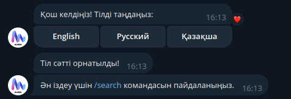
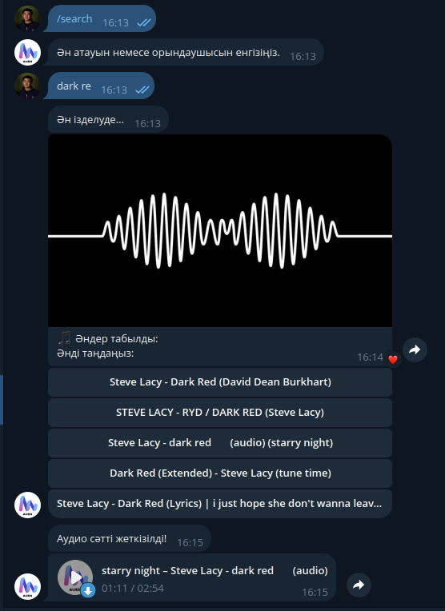

# Auen Music Bot

**Username:** [@auen_mus_bot](https://t.me/auen_mus_bot)

Auen Music Bot is your personal music assistant on Telegram. It searches for music on YouTube, downloads the audio as an MP3 file, and delivers it right into your chat. The bot also supports a multilingual interface—by default, it uses Russian, but users can choose English or Kazakh.

## Commands

- **/start**  
  *Description:* Launches the bot and prompts the user to select their language.  
  *Usage:* Simply type `/start` in the chat.
  

- **/search**  
  *Description:* Initiates the search process. Type a song title or artist after issuing this command to find music.  
  *Usage:* Type `/search` then your query (e.g., `/search Imagine Dragons`).
  

- **/help**  
  *Description:* Displays a list of available commands and instructions on how to use the bot.  
  *Usage:* Type `/help` in the chat.

- **/about**  
  *Description:* Provides information about Auen Music Bot, its functionality, and future plans.  
  *Usage:* Type `/about` in the chat.

